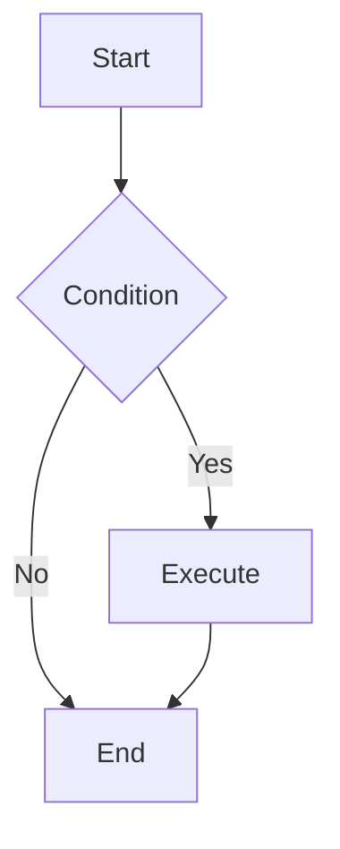

# Mermaid Diagram Generator

Generate high-quality Mermaid diagram code based on user requirements.

## Workflow

1. **Understand Requirements**: Analyze user description to determine the most suitable diagram type
2. **Read Documentation**: Read the corresponding syntax reference for the diagram type
3. **Generate Code**: Generate Mermaid code following the specification
4. **Apply Styling**: Apply appropriate themes and style configurations
5. **Emit HTML Version**: Also output a self-contained HTML file that renders the diagram
6. **Save to Disk**: Write the HTML file into the working directory (or a session-referenced folder — see File Placement)

## Diagram Type Reference

Select the appropriate diagram type and read the corresponding documentation:

| Type | Documentation | Use Cases |
| ---- | ------------- | --------- |
| Flowchart | [flowchart.md](references/flowchart.md) | Processes, decisions, steps |
| Sequence Diagram | [sequenceDiagram.md](references/sequenceDiagram.md) | Interactions, messaging, API calls |
| Class Diagram | [classDiagram.md](references/classDiagram.md) | Class structure, inheritance, associations |
| State Diagram | [stateDiagram.md](references/stateDiagram.md) | State machines, state transitions |
| ER Diagram | [entityRelationshipDiagram.md](references/entityRelationshipDiagram.md) | Database design, entity relationships |
| Gantt Chart | [gantt.md](references/gantt.md) | Project planning, timelines |
| Pie Chart | [pie.md](references/pie.md) | Proportions, distributions |
| Mindmap | [mindmap.md](references/mindmap.md) | Hierarchical structures, knowledge graphs |
| Timeline | [timeline.md](references/timeline.md) | Historical events, milestones |
| Git Graph | [gitgraph.md](references/gitgraph.md) | Branches, merges, versions |
| Quadrant Chart | [quadrantChart.md](references/quadrantChart.md) | Four-quadrant analysis |
| Requirement Diagram | [requirementDiagram.md](references/requirementDiagram.md) | Requirements traceability |
| C4 Diagram | [c4.md](references/c4.md) | System architecture (C4 model) |
| Sankey Diagram | [sankey.md](references/sankey.md) | Flow, conversions |
| XY Chart | [xyChart.md](references/xyChart.md) | Line charts, bar charts |
| Block Diagram | [block.md](references/block.md) | System components, modules |
| Packet Diagram | [packet.md](references/packet.md) | Network protocols, data structures |
| Kanban | [kanban.md](references/kanban.md) | Task management, workflows |
| Architecture Diagram | [architecture.md](references/architecture.md) | System architecture |
| Radar Chart | [radar.md](references/radar.md) | Multi-dimensional comparison |
| Treemap | [treemap.md](references/treemap.md) | Hierarchical data visualization |
| User Journey | [userJourney.md](references/userJourney.md) | User experience flows |
| ZenUML | [zenuml.md](references/zenuml.md) | Sequence diagrams (code style) |

## Configuration & Themes

- [Theming](references/config-theming.md) - Custom colors and styles
- [Directives](references/config-directives.md) - Diagram-level configuration
- [Layouts](references/config-layouts.md) - Layout direction and spacing
- [Configuration](references/config-configuration.md) - Global settings
- [Math](references/config-math.md) - LaTeX math support

## Safety

Default to strict rendering. Do not generate `securityLevel: loose`, JavaScript callbacks, or clickable external links unless the user explicitly requests them and accepts the risk.

## Output Specification

Generated Mermaid code should:

1. Be wrapped in ```mermaid code blocks
2. Have correct syntax that renders directly
3. Have clear structure with proper line breaks and indentation
4. Use semantic node naming
5. Include styling when needed to improve visual appearance
6. Always be accompanied by a self-contained HTML version (see below)

## HTML Output

In addition to the ```mermaid code block, always produce a self-contained, styled HTML file that renders the same diagram. Wrap it in an ```html code block. Use the Mermaid CDN with strict security (no `securityLevel: loose`). The template centers each diagram in a card, uses a clean system font, and adapts to light/dark mode (switching the Mermaid theme accordingly). Replace the diagram body inside the mermaid `<pre>` block with the generated Mermaid code, and update the `<title>`, `<h1>`, and caption text to match the diagram:

```html
<!DOCTYPE html>
<html lang="en">
<head>
  <meta charset="utf-8">
  <meta name="viewport" content="width=device-width, initial-scale=1">
  <title>Mermaid Diagram</title>
  <style>
    :root {
      --page-bg: linear-gradient(180deg, #f5f7fb 0%, #eef1f7 100%);
      --card-bg: #ffffff;
      --text: #1f2937;
      --muted: #6b7280;
      --shadow: 0 1px 2px rgba(15, 23, 42, 0.04), 0 8px 24px rgba(15, 23, 42, 0.06);
    }

    @media (prefers-color-scheme: dark) {
      :root {
        --page-bg: linear-gradient(180deg, #0f172a 0%, #111827 100%);
        --card-bg: #1e293b;
        --text: #e5e7eb;
        --muted: #94a3b8;
        --shadow: 0 1px 2px rgba(0, 0, 0, 0.3), 0 8px 24px rgba(0, 0, 0, 0.4);
      }
    }

    html, body {
      margin: 0;
      padding: 0;
    }

    body {
      font-family: -apple-system, BlinkMacSystemFont, "Segoe UI", Roboto, Helvetica, Arial, sans-serif;
      color: var(--text);
      background: var(--page-bg);
      background-attachment: fixed;
      line-height: 1.5;
      min-height: 100vh;
    }

    .page {
      max-width: 880px;
      margin: 0 auto;
      padding: 48px 24px 64px;
    }

    header.page-header {
      text-align: center;
      margin-bottom: 40px;
    }

    header.page-header h1 {
      margin: 0 0 8px;
      font-size: 2rem;
      font-weight: 700;
      letter-spacing: -0.01em;
    }

    header.page-header .subtitle {
      margin: 0;
      color: var(--muted);
      font-size: 1rem;
    }

    section.diagram {
      margin: 0 0 32px;
    }

    section.diagram h2 {
      margin: 0 0 4px;
      font-size: 1.125rem;
      font-weight: 600;
    }

    section.diagram .caption {
      margin: 0 0 12px;
      color: var(--muted);
      font-size: 0.9rem;
    }

    .card {
      background: var(--card-bg);
      border-radius: 12px;
      box-shadow: var(--shadow);
      padding: 24px;
      overflow: hidden;
    }

    pre.mermaid {
      margin: 0;
      display: flex;
      justify-content: center;
      background: transparent;
    }
  </style>
</head>
<body>
  <div class="page">
    <header class="page-header">
      <h1>Diagram Title</h1>
      <p class="subtitle">Short subtitle describing the diagram.</p>
    </header>

    <section class="diagram">
      <h2>Diagram</h2>
      <p class="caption">A concise caption for the diagram below.</p>
      <div class="card">
        <pre class="mermaid">
flowchart TD
    A[Start] --> B{Condition}
    B -->|Yes| C[Execute]
    B -->|No| D[End]
    C --> D
        </pre>
      </div>
    </section>
  </div>

  <script type="module">
    import mermaid from 'https://cdn.jsdelivr.net/npm/mermaid/dist/mermaid.esm.min.mjs';
    const theme = window.matchMedia('(prefers-color-scheme: dark)').matches ? 'dark' : 'default';
    mermaid.initialize({ startOnLoad: true, securityLevel: 'strict', theme });
  </script>
</body>
</html>
```

## File Placement

Always save the generated HTML file to disk (using the Write tool) in addition to showing the code blocks in chat. Choose the destination directory as follows, in priority order:

1. **Explicit path**: if the user names a directory or file path for the diagram, use it.
2. **Session-referenced folder**: Mermaid diagrams are usually requested after discussing specific code or files. Place the HTML next to the most relevant folder referenced earlier in the session — e.g. the directory of the file(s) or module the diagram describes.
3. **Current working directory**: if nothing more specific applies, save into the current working directory.

Naming:

- Use a short, descriptive, kebab-case filename ending in `.html` (e.g. `auth-flow.html`, `payment-sequence.html`).
- Prefer a name derived from the diagram's subject, not a generic name like `diagram.html`.
- Do not overwrite an existing file: if the target name exists, append a numeric suffix (e.g. `auth-flow-2.html`).

After saving, tell the user the exact path where the file was written.

## Example Output



---

User requirements: $ARGUMENTS
