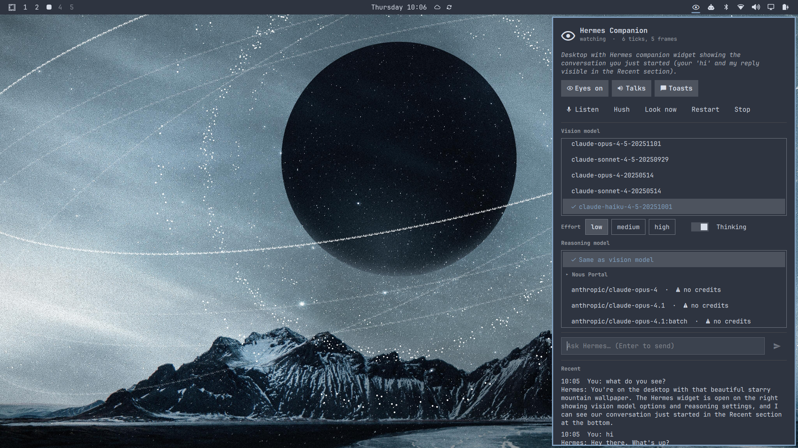

# Hermes Companion (Omarchy plugin)



Always-on Hermes agent: watches the focused monitor, speaks up when it judges it useful,
and supports explicit continuous microphone conversations (right-click the bar icon, the Listen button, or Super+Alt+H starts/stops listening). The popup provides **Coding**, **Meeting**, and **Quiet** profiles with isolated conversation histories. Meeting is silent and screen-paused by default; Quiet disables passive observation while still allowing explicit requests. Models: a **vision** model (must accept images; sees the screen) and an optional separate **reasoning** model
(default = same as vision). Lists are built from every provider Hermes has credentials for, grouped by provider,
with vision capability from models.dev / the Nous catalog. When the two differ, the vision model describes each
frame in a stateless one-shot and the reasoning model runs the persistent conversation on that text. Read-only tools only.

## Requirements
- Omarchy 4.x (`omarchy`, `omarchy-shell`, `grim`, `hyprctl`, `notify-send`, PipeWire tools) — `install.sh` offers `omarchy pkg add` for missing packages.
- Hermes Agent ≥ 0.21 at `~/.hermes/hermes-agent` (or `HERMES_AGENT_DIR`) — `install.sh` offers `omarchy install ai hermes` / `omarchy install hermes cli` if absent.
- At least one model provider credential (`hermes auth add …` or a Claude Code login). Not required to install; pick a vision model in the widget afterwards.
- Local speech-to-text (`faster-whisper`, installed by `install.sh`) for voice requests.

## Install
```bash
omarchy plugin add https://github.com/PSthelyBlog/omarchy-hermes-companion.git --enable
```
Enabling the plugin opens the installer in a floating terminal the first time (checks Omarchy tooling and Hermes,
installs Python deps into Hermes' venv, writes the systemd --user unit and Hyprland keybinds, starts the daemon).
Re-run it anytime: `~/.config/omarchy/plugins/hermes.companion/install.sh`. Update with `omarchy plugin update hermes.companion`.

## Uninstall
```bash
~/.config/omarchy/plugins/hermes.companion/uninstall.sh   # stops/disables the daemon, removes unit + keybinds
omarchy plugin remove hermes.companion                    # removes the plugin checkout
```
Python packages added to the Hermes venv (`pillow`, `faster-whisper`, `sounddevice`) are left in place; remove with
`uv pip uninstall` inside `~/.hermes/hermes-agent` if unwanted. Runtime state lives in `~/.local/state/hermes-companion/`.

## External dependencies
| Dependency | Why | Installed by |
|---|---|---|
| [Hermes Agent](https://github.com/NousResearch/hermes-agent) ≥ 0.21 (MIT) | model calls, STT/TTS pipeline, provider credentials | user / `omarchy install ai hermes` |
| `pillow`, `faster-whisper`, `sounddevice` (PyPI) | screenshot scaling, local speech-to-text, mic capture | `install.sh` → hash-verified `uv pip install --require-hashes -r requirements.lock` into the Hermes venv |
| `grim`, `hyprctl`, `notify-send`, PipeWire (`pw-record`, `pactl`, `wpctl`) | screenshots, window info, notifications, audio | Omarchy base; `install.sh` offers `omarchy pkg add` if missing |
| Edge TTS (via Hermes, network) | default voice output | Hermes |
| Model provider APIs (Anthropic, Nous Portal, …) | screen ticks and answers are sent to the selected provider | user credentials via `hermes auth` |

Screenshots are held in memory only and sent to the selected vision model; nothing is written to disk by the plugin
besides its state/config files. No `sudo` or `pkexec` is required.

### Pinned Python dependencies
`requirements.lock` pins every direct **and** transitive package to an exact version with sha256 hashes for each
accepted artifact. `install.sh` installs it with `uv pip install --require-hashes`, so a newly published or tampered
release cannot be pulled into the persistent Hermes environment; a hash mismatch aborts the install rather than
falling back to an unverified one. The cutoff matches the Hermes venv's own `exclude-newer` quarantine, so the lock
resolves inside it. To refresh the lock after a dependency bump:

```bash
printf 'pillow\nfaster-whisper\nsounddevice\n' |
  uv pip compile --generate-hashes --universal --python-version 3.11 \
    --exclude-newer "$(date -u -d '-15 days' +%Y-%m-%d)" -o requirements.lock -
```

## Actions (off by default)

Toggle **Actions** in the popup (or `--ctl toggle-actions`). Voice/text requests can then get
things *done*: the companion never runs commands itself — it hands the task to a Hermes
subagent (`delegate_task`) that has `terminal` and file tools. Screen ticks can never trigger
actions. Every child command passes through Hermes' own safety gate plus the companion policy
(`daemon/actions.py`):

| Tier | What | Behaviour |
|---|---|---|
| 0-3 | reads, builds, git, writes/deletes inside `$HOME` (not dotfiles), `/tmp` | runs |
| 4 | Hermes dangerous patterns (recursive delete, force push, pipe-to-shell, service restarts, …), anything touching dotfiles or paths outside `$HOME`, `pkill`, credential files | **asks**: toast with Run / Skip + spoken "May I run …? say yes or no" (30 s, silence = no) |
| 5 | Hermes hardline floors (`rm -rf ~`, `dd` to devices, `mkfs`, …), `sudo`/`pkexec`, system-scope `systemctl`, shutdown | refused |

Audit log: `~/.local/state/hermes-companion/actions.jsonl` (every run, write, approval, refusal).

## Privacy
Frames are skipped for password managers, private browsing, banking/OTP windows and the lock screen (see
`daemon/perception.py`); you can pause the eyes anytime from the widget or `Super+Alt+E`.

## Layout
- `daemon/companion.py`  main loop · `--ctl <cmd>` talks to the running daemon
- `daemon/perception.py` grim + hyprctl, dHash change detection, privacy filter (RAM only)
- `daemon/brain.py`      persistent Hermes AIAgent (web/file read-only), JSON tick protocol; native vs split vision
- `daemon/catalog.py`    provider/model catalog with vision flags (Hermes credentials + models.dev + Nous catalog)
- `daemon/voice.py`      continuous bounded Hermes VAD turns → local faster-whisper → edge TTS
- `daemon/profiles.py`   Coding / Meeting / Quiet behavior and isolation policy
- `daemon/policy.py`     cooldowns / fullscreen / call / idle gating for unprompted speech
- `daemon/state.py`      `~/.local/state/hermes-companion/state.json` + `$XDG_RUNTIME_DIR/hermes-companion.sock`
- `BarWidget.qml`        bar eye icon + popup (toggles, last remarks)   `Service.qml` starts the unit
- `companion.json`       tunables (tick_seconds, cooldowns) + `vision`/`reasoning` {model, effort, thinking}
- `hermes-companion.service.in` template → `~/.config/systemd/user/hermes-companion.service` (install.sh fills in the Hermes path)

## Commands
```
CTL="$HOME/.hermes/hermes-agent/venv/bin/python $HOME/.config/omarchy/plugins/hermes.companion/daemon/companion.py --ctl"
$CTL status | toggle-eyes | listen | stop-listening | set-profile <coding|meeting|quiet> | toggle-mute | toggle-toasts | toggle-actions | decide <yes|no> | hush | tick | models | set-vision <provider:model> | set-reasoning <provider:model|same> | set-{vision,reasoning}-effort <low|medium|high> | toggle-{vision,reasoning}-thinking | say <text> | ask <text> | toast <text> | quit
journalctl --user -fu hermes-companion
```
Keys: Super+Alt+H listen · Super+Alt+E eyes · Super+Alt+S hush. Bar icon: left = panel, right = listen, middle = hush.

