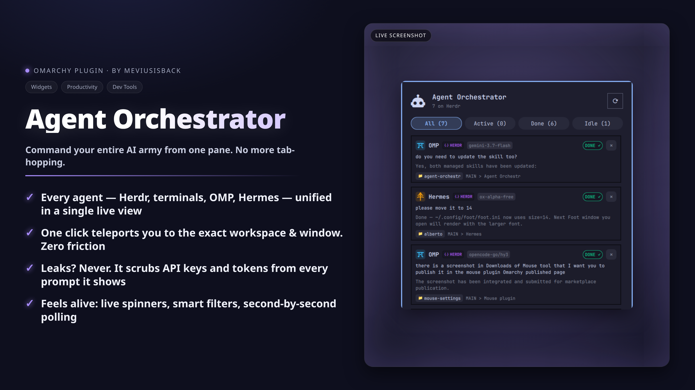

# Agent Orchestrator for Omarchy

Real-time status, active tasks, and one-click workspace switching for AI coding agents (**Herdr**, **OMP**, **Hermes**, **Claude**, **Codex**, **OpenCode**, **Agy** (Antigravity CLI), **Grok**) in the Omarchy bar.



## Features

- **Live Multi-Source Agent Tracking**: Seamlessly tracks AI coding agents across **Herdr** daemon panes (`~/.config/herdr/herdr.sock`), standalone terminal windows (Ghostty, Foot, Kitty, Alacritty, WezTerm), **OMP** sessions (`~/.omp/agent/sessions/`), **Hermes** CLI & Desktop app databases (`~/.hermes/state.db`), and **Grok** Build TUI sessions (`$GROK_HOME/active_sessions.json` + `events.jsonl`).
- **One-Click Workspace & Window Switching**: Click any agent card to switch Hyprland workspaces and focus the exact terminal window, Herdr pane, or Hermes Desktop window.
- **Visual Status Bar Display**:
  - **`Icon` Mode**: Agent orchestrator glyph with dynamic activity badge and spinner animation when agents are actively working.
  - **`Status` Mode**: Real-time ticker showing active task descriptions or prompt summaries.
  - **`Compact` Mode**: Live count summary (e.g. `4 ag · 1 busy`, `3 done`).
- **Interactive Popup Panel**:
  - **Smart Filter Tabs**: Filter by `All`, `Working`, `Waiting` (user input needed), `Done` (completed tasks), and `Idle`.
  - **Rich Agent Cards**: Model tags, latest human prompt, real-time tool execution details, repository / working directory breadcrumbs, and active session indicators.
  - **Process Management**: Safely terminate agent processes or close Herdr panes directly from card action buttons.
  - **Privacy First**: Automatic redaction of sensitive API keys and tokens from display prompts and status messages.
  - **Adaptive Fast Polling**: 1s live refresh while popup is open or agents are working; configurable interval when idle.

### Remote source setup

- **Herdr**: save a machine with `herdr machine add`, verify SSH access and matching remote Herdr installation. The plugin reads enabled rows from `herdr machine list --json` and queries each machine through Herdr's saved-machine forwarding. Remote cards keep focus and terminate disabled because their windows are not on this desktop, but Herdr cards can reply through the opaque saved profile ID.
- **Hermes Desktop gateways**: the plugin reads only non-secret labels and URLs from `~/.config/Hermes/connections.json`. OAuth tokens remain owned by Hermes Desktop. Full remote Hermes session cards require a future supported Desktop-to-bar roster bridge; this plugin does not scrape cookies, safeStorage, or token files.

### Herdr replies

Replies require Herdr **0.9.1 or newer** on the local machine and every saved remote. Upgrade explicitly and check the result before enabling replies; do not replace a running server blindly because stopping it may stop pane processes:

```bash
herdr --version
herdr update
herdr --version
```

Register remotes as saved machines, rather than placing SSH hosts or labels in plugin settings:

```bash
ssh workbox                         # accept the host key and verify ordinary SSH
herdr machine add workbox --label "Workbox"
herdr machine list --json           # use the opaque profile id from this output
herdr --machine <profile-id> agent list
```

For a named remote Herdr session, use `herdr machine add workbox --label "Workbox" --remote-session agents`. Passphrase-protected keys must be available through `ssh-agent`. The plugin never stores passwords, private keys, tokens, SSH sockets, hostnames, or saved-machine configuration; it sends only an opaque target ID and the reply text to its local controller.

The reply control sends one normal prompt to `idle` or `completed` agents and shows **Queue follow-up** for `working` agents. `waiting` and `blocked` cards show **Open to answer** instead: approval/question widgets require opening the Herdr session and cannot accept free-form `agent prompt` text. A successful submission shows **Sent** or **Queued** and refreshes status. Failed or ambiguous delivery keeps the draft in memory and never retries automatically; Cancel and closing the composer clear it.

The message is passed from QML to Python over bounded stdin JSON, but Herdr 0.9.1 accepts prompt text as a CLI argument. It may therefore be briefly visible in the local Herdr process argv to processes running as the same user. It is not interpolated into a remote shell command and prompt bodies are not logged or persisted. Use the normal screen-sharing `privacyHidePrompts` setting for agent-supplied task text; it does not hide text actively being typed.

### Herdr reply troubleshooting

- **No reply button**: confirm the card is a live Herdr card with `can_reply: true`, then verify `herdr --version` is 0.9.1+.
- **Open to answer**: open the session in Herdr and answer its approval/question UI; free-form replies are intentionally rejected for blocked/waiting agents.
- **Remote unavailable or stale**: verify `ssh <host>`, `ssh-add -l`, `herdr machine list --json`, and `herdr --machine <profile-id> agent list`. Re-enable or re-register the machine if its profile is disabled. The plugin will not fall back to Local.
- **Timeout or disconnect after Send**: delivery may be ambiguous. The draft is preserved; inspect the Herdr session before deciding whether to send again.
- **Reply text missing after Cancel**: this is intentional; drafts are never persisted.
## Installation

### Via Omarchy Marketplace / Plugin Manager

```bash
omarchy plugin add https://github.com/meviusisback/agent-orchestr --enable
```

### Manual Installation

Clone or symlink this repository into your Omarchy plugins directory:

```bash
mkdir -p ~/.config/omarchy/plugins
ln -sfn ~/repo/agent-orchestr ~/.config/omarchy/plugins/meviusisback.agent-orchestr
```

Then add `"meviusisback.agent-orchestr"` to your status bar layout in `~/.config/omarchy/shell.json`:

```json
{
  "id": "meviusisback.agent-orchestr",
  "barDisplay": "Icon",
  "refreshIntervalSec": 3
}
```

And restart the shell:

```bash
omarchy restart shell
```

## Removal

```bash
omarchy plugin remove meviusisback.agent-orchestr
```

Or manually remove the symlink/directory from `~/.config/omarchy/plugins/meviusisback.agent-orchestr` and remove `"meviusisback.agent-orchestr"` from `~/.config/omarchy/shell.json`.

## Claude Code Status (optional)

Claude Code doesn't keep a JSONL transcript file descriptor open the way OMP
does, and it exposes no local session/socket API the way Hermes does. Without
extra help, this plugin can only see that a `claude` process exists — it
falls back to a generic `idle`/"Ready for prompt" for every Claude session,
regardless of whether it's actually working, waiting on you, or done.

To get real `working` / `waiting` / `completed` status for Claude Code,
install the bundled hook script, which writes a small status file per
session that `agent_ctl.py` reads (see `read_claude_hook_status()`):

```bash
mkdir -p ~/.claude/hooks
cp hooks/claude-code-status.sh ~/.claude/hooks/
chmod +x ~/.claude/hooks/claude-code-status.sh
```

Then merge this into your `~/.claude/settings.json` (merge the `PreToolUse`
matcher alongside any existing entries — don't replace the array):

```json
{
  "hooks": {
    "PreToolUse": [
      {
        "matcher": ".*",
        "hooks": [{ "type": "command", "command": "~/.claude/hooks/claude-code-status.sh", "timeout": 5 }]
      }
    ],
    "UserPromptSubmit": [
      { "hooks": [{ "type": "command", "command": "~/.claude/hooks/claude-code-status.sh", "timeout": 5 }] }
    ],
    "Notification": [
      { "hooks": [{ "type": "command", "command": "~/.claude/hooks/claude-code-status.sh", "timeout": 5 }] }
    ],
    "Stop": [
      { "hooks": [{ "type": "command", "command": "~/.claude/hooks/claude-code-status.sh", "timeout": 5 }] }
    ],
    "SubagentStop": [
      { "hooks": [{ "type": "command", "command": "~/.claude/hooks/claude-code-status.sh", "timeout": 5 }] }
    ],
    "SessionEnd": [
      { "hooks": [{ "type": "command", "command": "~/.claude/hooks/claude-code-status.sh", "timeout": 5 }] }
    ]
  }
}
```

The script keys each status file by the actual `claude` process's PID (walking
up `/proc` ancestry from the hook's own `$PPID`, since the hook runs as a child
process, not as `claude` itself), matching how `agent_ctl.py` already identifies
Claude sessions — `cwd` alone would not, since concurrent sessions can share a
working directory. Files are removed on `SessionEnd`, and any left behind by a
session that was `SIGKILL`ed are pruned on the next one.

Installing the hook is purely additive: without it, Claude Code sessions behave
exactly as they do today (generic idle fallback).

## Grok Build TUI

Grok already writes a live roster (`$GROK_HOME/active_sessions.json`, default
`~/.grok`) and a status event stream (`events.jsonl`) per session. The collector
reads those files directly — no hook install is required.

Interactive sessions are `grok`, `grok --resume …`, `grok --session-id …`, or
`grok "<prompt>"`. CLI verbs (`grok login`, `grok mcp`, `grok agent`,
`grok doctor`, …) share the same binary and are skipped by an exact `argv[1]`
match, the same way Claude Code helpers are. **Headless and info-only
invocations are not sessions either** — `grok -p/--single`, `--prompt-file`,
`--prompt-json`, `--output-format`, `--json-schema`, `-v/--version`,
`-h/--help` and `--show-current` are recognised by exact token anywhere in the
argument list, so a one-shot run never produces a card. The mise
`node …/bin/grok` wrapper is not counted: its `argv[0]` is `node`. Forked
`subagent*` sessions are skipped so the parent card is not doubled.

A live session is resolved from the roster by **PID**, then by its session id,
and only as a last resort by working directory — the session id is the reliable
key, so concurrent sessions in one directory stay distinct and the layout Grok
uses for very long paths (a slug+hash group with the real path in a `.cwd`
marker file, used when the URL-encoded directory name exceeds 255 bytes) is
found without guessing its name. The deterministic encoded group name is always
preferred: a `.cwd` marker is local file content, so a group that merely *claims*
a working directory can never outrank the real one, nor spend the budget the real
card's summary and event reads need. When an invocation passes `--cwd`, the
process working directory is ignored and the session's own directory is shown. A
session that cannot be resolved gets no card rather than a wrong one; the cwd
fallback is the one place where a session the roster has not recorded can be
attributed by recency instead, which is why it needs the process-start window and
never reuses a session another card already claimed.

Status mapping: `streaming_*` / `tool_execution` → `working`; `permission_prompt`
and an unanswered `permission_requested` → `waiting`; `turn_ended` →
`completed`; otherwise `idle`. Events are folded in log order, so the newest
event decides: a tool that started after a permission prompt reads as
`working`, and a `permission_prompt` phase left behind by an auto-allowed ask is
cleared by its `permission_resolved`.

Everything read under `$GROK_HOME` goes through one guarded reader: it refuses
symlinked, foreign-owned or group/world-writable paths, opens files with
`O_NOFOLLOW | O_NONBLOCK`, and verifies the opened file descriptor (owner,
regular file, single hard link, size cap, containment in `$GROK_HOME`) before
reading. It caps each file and the total work per refresh cycle, memoizes parsed
JSON, the group list and the group → `.cwd` mapping for the cycle, and widens a
JSONL tail when the window would otherwise start inside a line — the newest
events decide the status, so a large-but-valid event must not be lost. Every
string it returns is treated as untrusted UI text through the same secret
redaction as the rest of the plugin: prompts, titles, event tool names, the model
id, and the `.cwd` marker (accepted only when it actually looks like an absolute
path). A malformed, half-written, oversized, hard-linked or planted file
therefore degrades to "no detail" instead of a wrong card, a hang or a read
outside the Grok data directory. The panel also runs the collector as a direct
child (no shell pipeline) and aborts a tick that overstays, so a wedged helper
can neither disable refresh nor be left behind.

> Known limits (honest, not aspirational): the exact byte-for-byte encoding Grok
> uses for group names has not been captured on a live session, so cwd-only
> resolution (used for Orca/Herdr panes, which have no PID) relies on the
> documented URL-encoding plus the `.cwd` marker; the `session_kind` values that
> mark subagent sessions are likewise taken from the documented layout. Both
> degrade to a missing card, never a wrong one — and PID-resolved sessions do
> not depend on either. The cwd-only fallback cannot bind a session to a process:
> it considers at most 32 `.cwd`-claiming groups and the 32 newest sessions in
> each, ranked by recency, so the newest session in that directory is what an
> Orca/Herdr card shows and a locally planted newer session there would win that
> card (PID-resolved cards never look at markers). A single event line larger than
> 512 KiB is still skipped
> (the window stops widening there), and the per-cycle budget is a bound on work,
> not a promise that every card is enriched when a tree is pathological. The path
> guard reads POSIX mode bits, so a directory whose write access comes only from
> an ACL is not detected (Grok's own tree is 0755/0644 by default); the descriptor
> containment check needs `/proc`, making Grok enrichment Linux-only; and the
> ancestor-path check cannot fully close a TOCTOU race without an `openat` chain.
> The plugin is a local read-only collector, so those residuals are accepted
> rather than claimed fixed.

## Keybinding

You can toggle the popup panel with a global Hyprland keyboard shortcut.

Add the following to `~/.config/hypr/bindings.lua`:

```lua
o.bind("SUPER + A", "Agent Orchestrator", "omarchy shell meviusisback.agent-orchestr toggle")
```

### Shell IPC Commands

```bash
# Toggle popup panel
omarchy shell meviusisback.agent-orchestr toggle

# Explicit open / close
omarchy shell meviusisback.agent-orchestr open
omarchy shell meviusisback.agent-orchestr close

# Force refresh live status
omarchy shell meviusisback.agent-orchestr refresh
```
## Settings

| Key | Default | Description |
|---|---|---|
| `barDisplay` | `"Icon"` | `"Icon"`, `"Status"`, or `"Compact"` |
| `refreshIntervalSec` | `3` | Polling frequency in seconds |
| `showIdleInBar` | `false` | Whether to display badge count when all agents are idle |
| `maxTaskLength` | `45` | Maximum characters shown in the bar status ticker |
| `privacyHidePrompts` | `false` | Hide agent-supplied prompt and task text in the bar and cards (counts, status, repo and workspace only) — for screen sharing and recordings |
| `panelWidth` | `760` | Popup width (380–1400, clamped to the screen). The expanded card shows the multi-line last response, so wider = more readable |
| `panelHeight` | `760` | Popup height (400–1400, clamped to the screen) |


## Tests

`agent_ctl.py` ships a hermetic fixture suite for the Grok collector. It points
`GROK_HOME` at a temporary directory, touches no network, no `hyprctl`, no Orca
and no real `~/.grok`, and never runs a full `fetch_all_agents()` cycle:

```bash
python3 tests/test_grok_sessions.py
```

## Security & Privacy

- **Zero Network Transmission**: All agent tracking and process inspection runs 100% locally on your machine.
- **Automatic Secret Redaction**: Prompts and status lines automatically redact API keys (OpenAI, Anthropic, OpenRouter, Groq), GitHub tokens, AWS keys, and Bearer tokens before UI rendering or IPC output.
- **Read-Only SQLite & Session Parsing**: Hermes databases are queried strictly with `?mode=ro`, and OMP transcripts are parsed in read-only mode.
- **Validated Hook Input**: Claude Code status files are trusted only when they carry a known status value and a fresh timestamp, and their detail line passes through the same redaction as every other agent detail.
- **Guarded Grok Session Reads**: Everything read under `$GROK_HOME` is refused unless the whole path chain is user-owned, not a symlink and not group/world-writable; files are opened with `O_NOFOLLOW | O_NONBLOCK` (so a planted FIFO cannot block the collector) and the opened descriptor is re-verified — owner, regular file, single hard link, size, containment — before any bytes are read. Session ids from `active_sessions.json` are validated as UUIDs before they are used in a path, event-supplied detail text passes through the same redaction as every other detail, per-file sizes and total work per refresh cycle are capped, and anything that fails degrades to *no card* rather than a wrong one.
- **Prompt Hiding Option**: `privacyHidePrompts` keeps agent-supplied prompt and task text out of the bar ticker and the cards entirely — including tab/pane labels, which can carry task text — leaving counts, status, repo path and workspace name. Secret redaction stays on regardless.
- **Safe Process Signaling**: Process termination verifies the target PID against active AI agent process signatures before signaling.
- **Shell & Injection Safety**: All subprocess and Hyprland dispatch operations use discrete argument vectors without shell evaluation (the status refresh execs the collector directly, with the payload bounded inside it rather than by a shell pipeline), and QML Text components enforce plain-text formatting.
- **Bounded Status Payload**: the collector caps the number of agent cards and the serialized reply size, so a pathological machine cannot make the widget's stdio collector accumulate unbounded output.
- **Plain-Text Convention**: Every `Text` element in `Panel.qml` must declare `textFormat: Text.PlainText` explicitly — agent-supplied strings (titles, labels, paths) must never render through QML's default `AutoText`, which would interpret rich-text markup as shell UI. New widgets should preserve this invariant.
## License

MIT
